# Animal Sounds - Children's Learning App

A feature-rich educational Flutter application designed to help children (ages 2-6) discover and learn about animals through interactive experiences, games, and creative activities.

<p align="center">
  
</p>

## Features

### Core
- **30+ Animal Sounds** - Listen to realistic sounds with playback controls
- **Animal Info Pages** - Descriptions, size, weight, lifespan, habitat, diet, fun facts
- **Text-to-Speech** - All content is narrated in every supported language
- **Category Filtering** - Browse by Wild, Domestic, Sea, Farm, Forest, Desert, Birds, Insects

### Games & Activities
- **Quiz Mode** - 5-question quizzes with hints, extra lives, and double score (rewarded ads)
- **Guess the Sound** - Endless mini-game with high score tracking
- **Animal Comparison** - Compare two animals side by side (size, weight, lifespan)
- **Finger Painting** - Draw and color with 12 colors, 3 brush sizes, save to gallery
- **Voice Recorder** - "You Try!" - Kids record themselves imitating animal sounds

### Engagement & Progression
- **Daily Animal Discovery** - A new animal to discover every day with streak tracking
- **Animal Collection** - Track progress discovering all 30 animals
- **20 Achievements** - Badges across 5 categories with confetti celebrations
- **Weekly Challenges** - 3 rotating challenges per week
- **Local Notifications** - Daily reminders and streak alerts

### Monetization
- **Banner Ads** - Non-intrusive banner placement
- **Interstitial Ads** - Shown after every 15 sound plays
- **Rewarded Ads** - Optional ads for quiz hints, extra lives, double score, fun facts, achievement hints

### Other
- **Parent Dashboard** - Math-gated usage statistics and learning progress
- **8 Languages** - English, Turkish, Russian, Portuguese, Hindi, Spanish, Arabic, German
- **Offline Support** - All features work without internet
- **Material 3 Design** - Modern, child-friendly UI with bottom tab navigation

## Screenshots

<p align="center">
  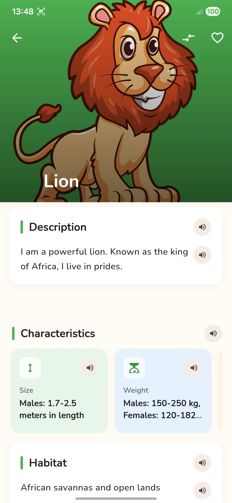
  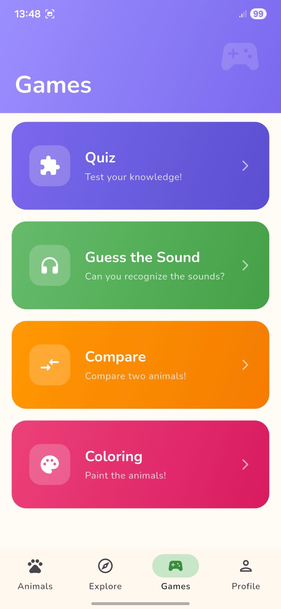
  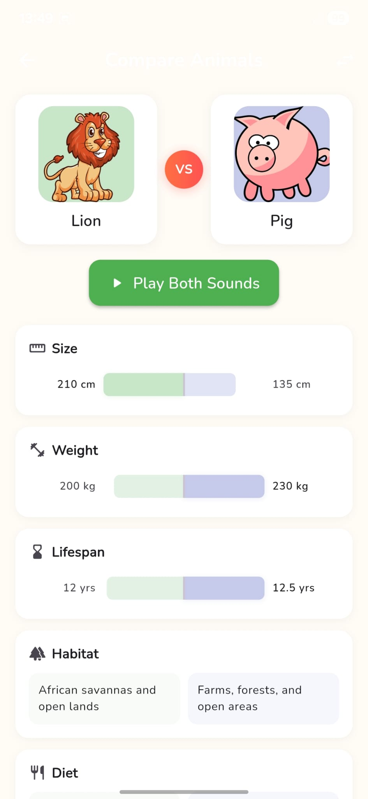
  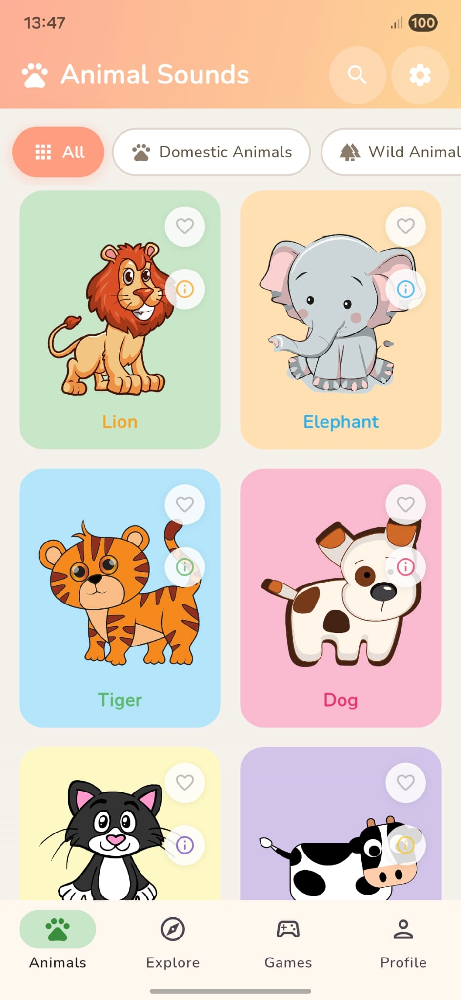
</p>

<p align="center">
  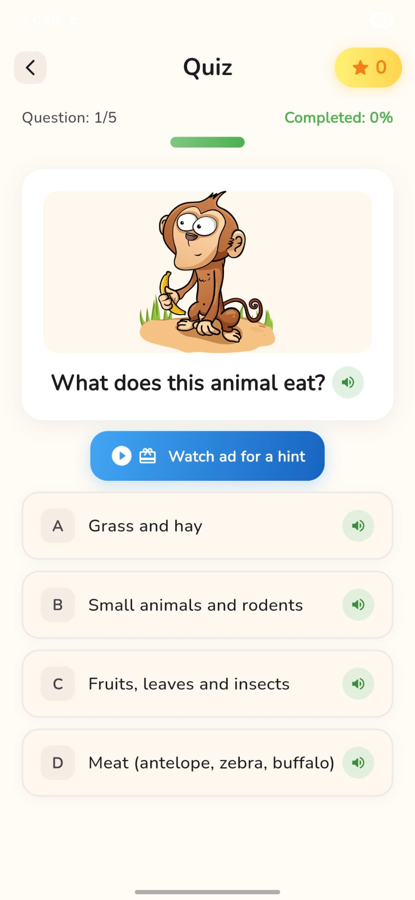
  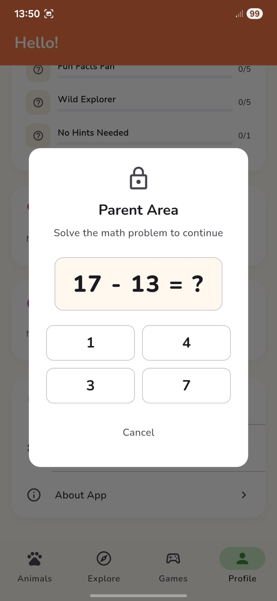
  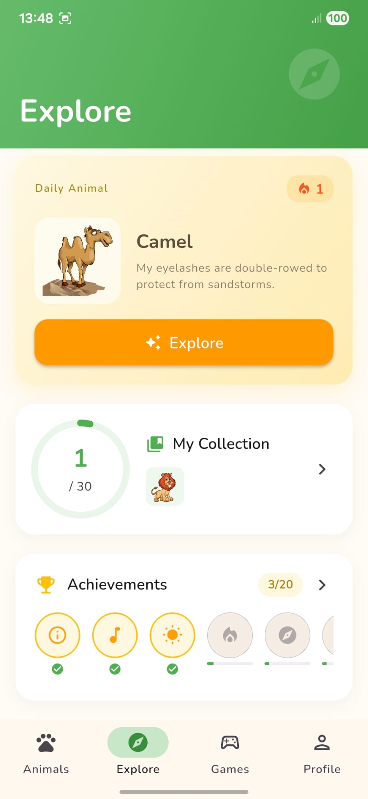
  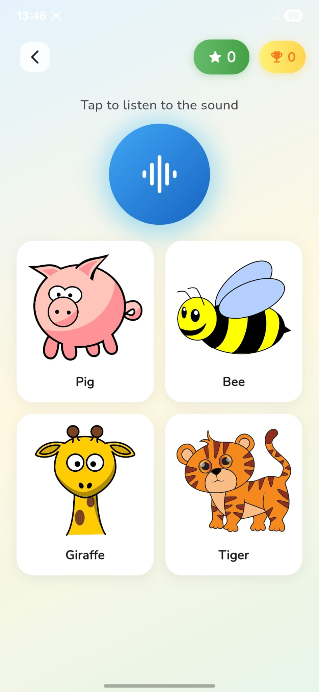
</p>

<p align="center">
  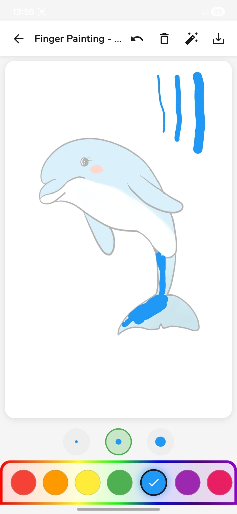
  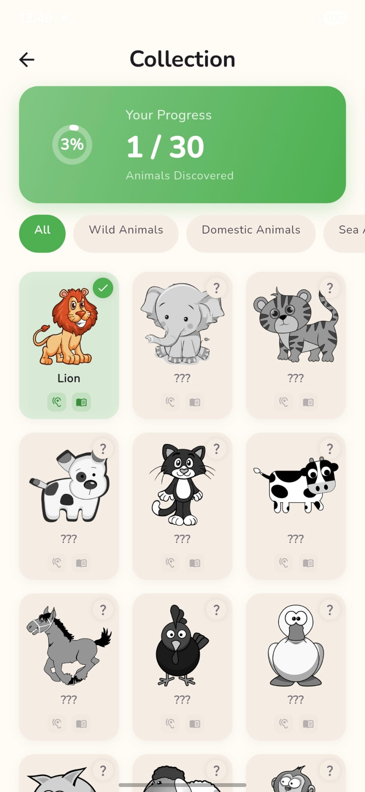
  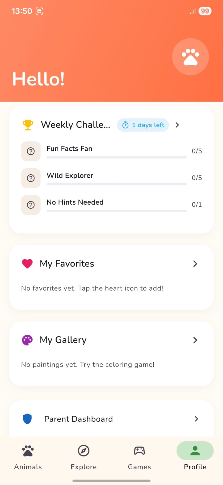
  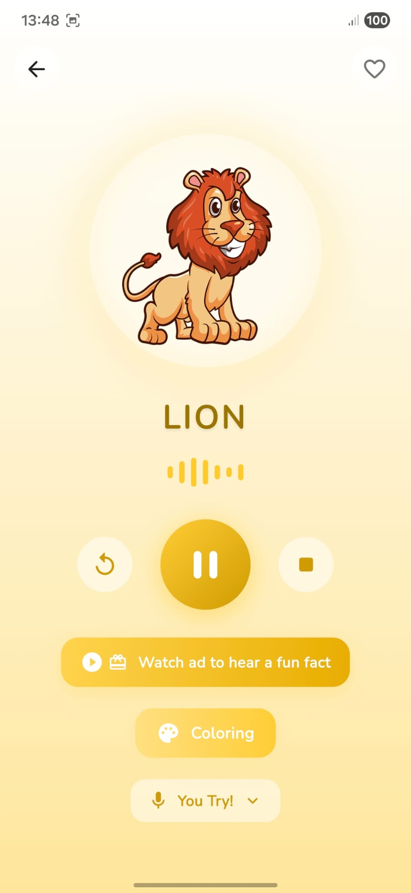
  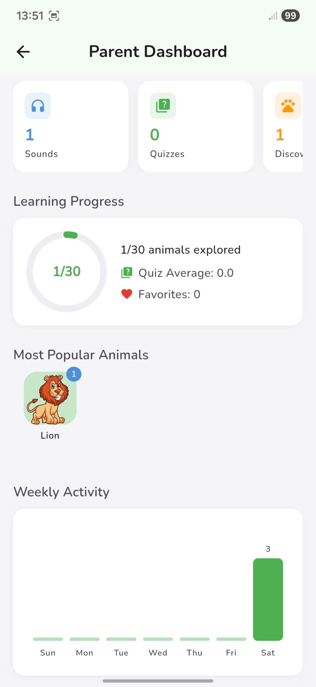
</p>

## Architecture

```
lib/
  main.dart                    # App entry, providers, theme
  models/                      # Data models (Animal, Achievement, Discovery, etc.)
  pages/
    main_navigation_page.dart  # Bottom tab navigation
    tabs/                      # 4 tab pages (Animals, Explore, Games, Profile)
    animal_sound_page.dart     # Sound playback with controls
    animal_info_page.dart      # Detailed animal information
    quiz_page.dart             # Quiz with rewarded ad integration
    sound_guess_game_page.dart # Endless sound guessing game
    compare_page.dart          # Side-by-side animal comparison
    coloring_page.dart         # Finger painting canvas
    collection_page.dart       # Discovery progress grid
    daily_discovery_page.dart  # Daily animal with streak
    weekly_challenge_page.dart # Weekly challenges
    parent_dashboard_page.dart # Usage statistics
    gallery_page.dart          # Saved paintings
  providers/                   # State management (Provider + ChangeNotifier)
  repositories/                # Data sources (animals, categories, quiz questions)
  services/                    # Ad service, notification service, audio recorder
  widgets/                     # Reusable UI components
  utils/                       # Colors, styles, helpers
```

## Tech Stack

- **Flutter** 3.35+
- **State Management** - Provider
- **Localization** - easy_localization (8 languages)
- **Audio** - audioplayers, flutter_tts
- **Ads** - google_mobile_ads (banner, interstitial, rewarded)
- **Notifications** - flutter_local_notifications
- **Storage** - shared_preferences, path_provider
- **Design** - Material 3 with Google Fonts (Nunito)

## Installation

The app is available on Google Play:

https://play.google.com/store/apps/details?id=com.devork.animalsounds

## Development Setup

1. Clone the repository:
```bash
git clone https://github.com/orkuneyb/animal_sounds_flutter.git
```

2. Install dependencies:
```bash
flutter pub get
```

3. Run the app:
```bash
flutter run
```

4. Build release APK:
```bash
flutter build apk --release
```

## Supported Languages

| Language | Code | Native Name |
|----------|------|-------------|
| English | en-US | English |
| Turkish | tr-TR | Turkce |
| Russian | ru-RU | Russkiy |
| Portuguese | pt-BR | Portugues |
| Hindi | hi-IN | Hindi |
| Spanish | es-ES | Espanol |
| Arabic | ar-SA | Al-Arabiyya |
| German | de-DE | Deutsch |

## Developer

Developed by DevOrk

## Contact

- Email: orkuneyb@gmail.com
- Website: https://orkuneyuboglu.com

---

<p align="center">
  Made with care for children's education
</p>
